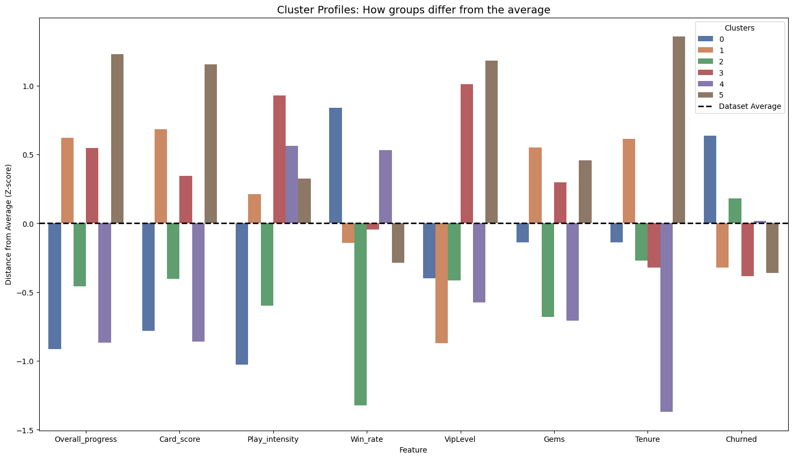
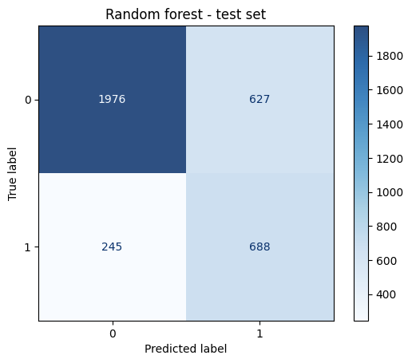
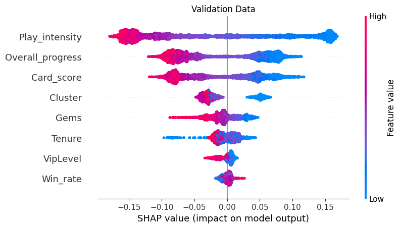
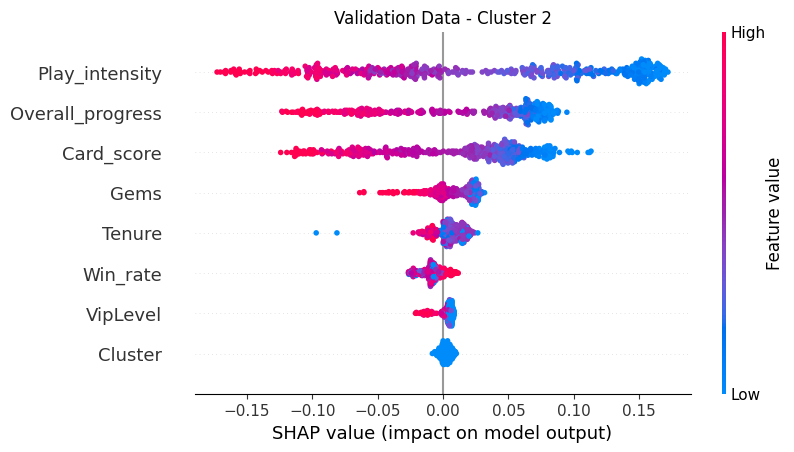
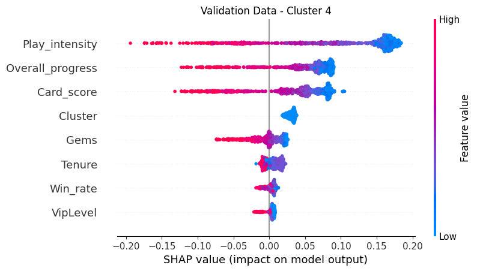

# Player Churn Archetype & Predictive Analysis

## Project Overview
The goal of this project is to develop a robust churn detection system for a mobile game. The methodology follows a two-stage approach:

- **Unsupervised Profiling:** Utilizing a K-Means Clustering model to segment the player base into distinct archetypes based on behavior and progression.

- **Supervised Prediction:** Integrating these cluster labels as features into a Random Forest classifier. This allows the model to obtain player "context" to predict the likelihood of churn and identify the specific drivers behind player attrition through SHAP value analysis.

**[Read the Executive Summary for Stakeholders](Reports/Executive_summary.MD)**

## Project Workflow
### 1. Data Ingestion and Cleaning
Notebook: [1_read_df.ipynb](1_read_df.ipynb)
- This stage focuses on consolidating three primary data sources: general.csv, cards.csv, and campaigns.csv.

- Players with impossible statistics (e.g., negative Gold/Gems or excessive play intensity) are removed to ensure data integrity.

- The analysis focuses on established players (Avatar Level 20 to 220), excluding the highly volatile First Time User Experience (FTUE) stage.

- To ensure the model learns from recent game balance and player behavior, only users active within 90 days of the data snapshot are included.

- Custom metrics like `Card_score` (normalized power across rarities) and `Overall_progress` (campaign completion percentage) are engineered and merged into a master dataframe.

### 2. Feature Engineering & Machine Learning
#### 2.1. Feature selection

- `Overall_progress`: It summarizes how deep into the game the player is.

- `Card_score`: This is the overall card score calculated based on the levels and rarity of the cards in the player's collection.

- `Play_intensity`: This represents how much did users play while they were "active".

- `Win_rate`: This is the total games won compared to the total games played.

- `VipLevel`: This is an indicator of "Lifetime Value." It represents better the amount spent, and not just the quantity.

- `Gems`: Player with high gem balance are more likely to stay engaged with the game than those with low balance.

- `Tenure`: It represents for how long have been the players around. It tells if a player have just finished the FTUE or if it an experienced player.

#### 2.2. Unsupervised profiling (K-Means clustering)
In this project, a K-Means clustering was applied to a dataset of 17,000+ players to move beyond "one-size-fits-all" marketing and identify high-value behavioral segments. While mathematical metrics like the Silhouette Score initially suggested a broad 2-cluster split, a 6-cluster model was selected. This decision was driven by a local peak in the Silhouette metric and a need for greater granularity, which successfully uncovered distinct archetypes that a 2-cluster model would have obscured.

  

##### Archetypes

|Cluster|Name|Risk Level|Key Characteristics|Behavioral Insights|
|---|---|---|---|---|
|0|New Players|Neutral|Lowest tenure (-1.36), high play intensity (+0.59), high win rates.|Currently getting out of the FTUE phase. Future retention depends on how they handle upcoming difficulty spikes.|
|1|Grinders|Safe (Low)|High tenure (+0.60), lowest VIP level (-0.86), consistent progress.|Classic Free-to-Play veterans. They don't spend money but provide high value through long-term engagement and time investment.|
|2|Frustrated|Elevated|Lowest win rate (-1.28), low play intensity, low gem count.|Struggling to win or progress. They are likely hitting a wall and are at high risk of quitting due to poor game experience.|
|3|Fans|Safe (Very Low)|Max tenure (+1.37), VIP (+1.20), and progress (+1.25).|The most valuable users and long-term fans. Deeply invested financially and emotionally, despite a slightly below-average win rate.|
|4|Bored|Critical|Highest churn risk (+0.63), lowest intensity (-1.03), high win rate (+0.88).|Top priority. They find the game too easy or unengaging. They need end-game content or difficulty scaling to prevent immediate churn.|
|5|Fast Progress|Safest|Highest intensity (+0.89), high VIP level (+1.01), low tenure.|Relatively new players who are aggressively buying their way to the top. They are hyper-engaged and currently the most stable group.|

#### 2.3. Supervised Prediction (RandomForest)
Notebook: [2_modeling.ipynb](2_modeling.ipynb)

To validate the clustering, the `Cluster` ID is included as a feature in the Random Forest. Note that this variable is a raw number (no One-Hot encoded), as the Random Forest's structure is robust enough to handle these integer labels as decision splits.

The target variable has a class inbalance of 74/26, meaning the users flagged as churned are less represented in the data set. This would introduce bias in the model if not adressed. To solve this the model uses `class_weight='balanced'` within the RandomForestClassifier.

##### **Random Forest Model performance**

The model achieved a Recall of 74%, ensuring that the majority of players at-risk are identified for retention campaigns. While the Precision of 52% indicates a high number of false positives, this is an acceptable trade-off in a churn context where the cost of player loss outweighs the cost of unnecessary engagement

  

##### **SHAP Analysis**

  

* Play_intensity is the clear leader: The wide horizontal spread (from -0.20 to +0.15) shows this is the most influential factor.
    - High intensity (red) is pushed far to the left (negative SHAP). This means high engagement is a massive "retention shield" against churn.
    
- Once a player invests enough to get a high card score `Card_score` or deep progress `Overall_progress` (red), they are significantly less likely to leave. The "barrier to exit" is high.

- SHAP analysis revealed that the `Cluster` assignment was the #4 most influential predictor of churn. This proves that the archetypes identified by K-Means captured unique behavioral contexts that are critical for accurate prediction.

- The `Gems` are clustered around the center but lean slightly negative. This suggests that while having gems helps, it's not a good retention shield if the player isn't actually playing or progressing.

- `Win_rate` is surprisingly low: This is a huge finding. It suggests players don't necessarily quit because they lose; they quit because they stop engaging with the core loops (Intensity/Progress).

##### **SHAP analysis of archetypes at risk**

The Random Forest model revealed that churn is not a monolithic event. By analyzing SHAP values across clusters, it was discovered that Cluster 4 (Bored) players churn due to stagnation (high win rate but low intensity), while Cluster 2 (Frustrated) players churn due to friction (low win rate and low progression). This proves that a single retention campaign across all users would fail; the "Bored" players need a challenge, while the "Frustrated" players need support.

  
  

-  The "Frustrated" (Cluster 2) players with very low win rate. Their SHAP plot shows that `Win_rate` has a higher negative impact here than in other groups. They are hitting a "difficulty wall" early and quitting out of frustration. 

- The "Bored" (Cluster 4) players are winning more than average, but they aren't playing much. They are "bored winners." They likely haven't found the progression loop isn't compelling enough to make them spend their time.

## Key Insights for Stakeholders
- Through unsupervised learning, distinct player [Archetypes](#archetypes) were identified. This allows for tailored retention strategies instead of a "one-size-fits-all" approach. 

- `Play_intensity`, `Overall_progress`, and `Card_score` are the primary churn drivers. The SHAP plot shows that low values for these features have a massive positive impact on churn.

- Players who aren't making progress or building their card collection early on are the most likely to drop off.

- The model has high Recall 74% (it's catching most churners) but lower Precision 52% (it's flagging many non-churners as "at risk"). For a churn system, it's better to send a gift to a loyal player than to miss a player who is actually leaving.

## Strategic Recommendations

- Implement the model to identify users at risks before they leave, and perform Re-engagement campaigns according to their archetype.

- Targeted at the "Furstated" Cluster 2:
  - Implement a Dynamic Difficulty Adjustment (DDA). If a player in this cluster loses 3 times in a row, subtly decrease the difficulty or give them a temporary buff.

  - Implement Pity Mechanics. Offer "rebound" rewards after a loss streak to keep their Gems or `Card_score` moving upward despite the losses.

- Targeted at the "Bored" Cluster 4:
  - Introduce daily login rewards or time-sensitive events specifically targeted at this cluster to increase their `Play_intensity`.
    
  - Show them what high-level gameplay looks like. Since they are good at the game (high win rate), challenge them with a "Hard Mode" or a competitive ladder to spark interest.
  
- Since `Overall_progress` and `Card_score` are such heavy predictors, churning is happening early.
    - Smooth out the "Card Score" progression. If a player’s score is below the Z-score average by Level X, trigger a "Special Starter Pack" offer.
    - Check if there is a specific level or card-unlock threshold where progress slows down significantly.

- `Gems` is a mid-tier predictor. The SHAP plot shows that having low Gems is correlated to churn.
    - Give small amounts of gems for completing tasks or quests (like playing 5 matches a day). This increases `Play_intensity` and provides the `Gems` needed to improve `Card_score`.

## Tech Stack
* Languages: Python (Pandas, NumPy)
* Frameworks: Scikit-Learn (Kmeans, RandomForest), SHAP
* Validation: 60/20/20 Train/Validation/Test split
* To run this notebook locally, please refer to the [requirements.txt](requirements.txt) for environment dependencies.

## Next steps
- Feature Engineering: Since Tenure is a lower-impact feature, consider creating a "Velocity" feature (e.g., Progress / Tenure). A player who progresses quickly but then stops is a different churn risk than one who never progressed at all.

- Address False Positives: To improve precision, look at the players your model thought would churn but didn't. What did they do? Did they join a guild? Did they make a small purchase? Use those actions as "Retention Nudges" for the at-risk clusters.
