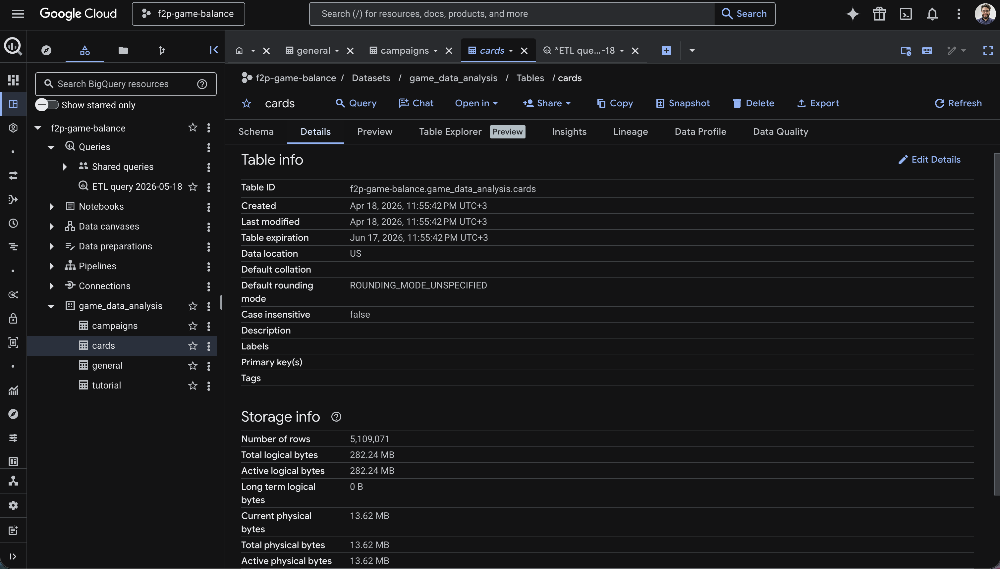
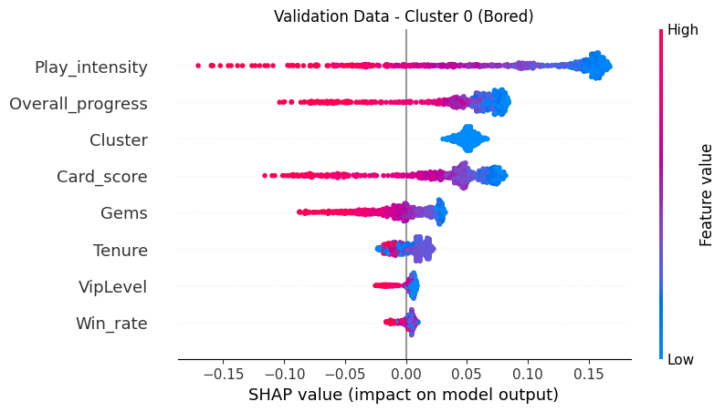

# Player Churn Archetype & Predictive Analysis

## Project Overview

The goal of this project is to develop a robust churn detection system for a mobile game. Rather than just applying machine learning to a pre-cleaned dataset, this project demonstrates an end-to-end data pipeline—from cloud data warehousing and advanced SQL transformations to predictive modeling. 

The methodology follows a comprehensive three-stage approach:

- **Data Engineering & Feature Creation (BigQuery & SQL):** Ingesting and processing over 5.1 million rows of real, production-level game data via Google BigQuery. Complex SQL transformations were utilized to consolidate disparate datasets, enforce data integrity (filtering out impossible statistics), and engineer vital custom metrics (such as `Card_score` and `Overall_progress`) prior to modeling.

- **Unsupervised Profiling (Machine Learning):** Utilizing a K-Means Clustering model to segment the player base into distinct archetypes based on their behavior and progression features engineered in the database.

- **Supervised Prediction (Machine Learning):** Integrating these cluster labels as features into a Random Forest classifier. This provides the model with player "context" to predict the likelihood of churn, while SHAP value analysis pinpoints the specific drivers behind player attrition.

**[Read the Executive Summary for Stakeholders](./Reports/Executive_summary.MD)**

## Project Workflow

### 0. Data Anonymization & Extraction
This project uses real, production-level game data. To comply with data privacy standards, the data was strictly anonymized resulting in four core datasets (general, cards, tutorial, and campaigns)

### 1. Data Ingestion (Cloud Storage)

Data Ingestion Script: [1_data_ingestion.py](1_data_ingestion.py)

In this stage the anonymized data was ingested into BigQuery to handle the scale of the data efficiently.

*Google BigQuery console displaying the active schema architecture and storage details for the 5.1-million-row card dataset.*

### 2. Data Transformation and Preparation

Query Logic: [2_read_df.sql](2_read_df.sql)

- This stage focuses on consolidating three primary data tables from BigQuery: general, cards, and campaigns.

- Players with impossible statistics (e.g., negative Gold/Gems or excessive play intensity) are removed to ensure data integrity.

- The analysis focuses on established players (Avatar Level 20 to 220), excluding the highly volatile First Time User Experience (FTUE) stage.

- To ensure the model learns from recent game balance and player behavior, only users active within 90 days of the data snapshot are included.

- Custom metrics like `Card_score` (normalized power across rarities) and `Overall_progress` (campaign completion percentage) are engineered and merged into a master dataframe.

### 3. Feature Engineering & Machine Learning
Notebook: [3_modeling.ipynb](https://colab.research.google.com/github/davidzg/Player-Churn-Detection-System/blob/main/3_modeling.ipynb)
#### 3.1. Feature selection

- `Overall_progress`: It summarizes how deep into the game the player is.

- `Card_score`: This is the overall card score calculated based on the levels and rarity of the cards in the player's collection.

- `Play_intensity`: This represents how much did users play while they were "active".

- `Win_rate`: This is the total games won compared to the total games played.

- `VipLevel`: This is an indicator of "Lifetime Value." It represents better the amount spent, and not just the quantity.

- `Gems`: Player with high gem balance are more likely to stay engaged with the game than those with low balance.

- `Tenure`: It represents for how long have been the players around. It tells if a player have just finished the FTUE or if they are an experienced player.

#### 3.2. Unsupervised profiling (K-Means clustering)
In this project, a K-Means clustering was applied to a dataset of 17,000+ players to move beyond "one-size-fits-all" marketing and identify high-value behavioral segments. While mathematical metrics like the Silhouette Score initially suggested a broad 2-cluster split, a 6-cluster model was selected. This decision was driven by a local peak in the Silhouette metric and a need for greater granularity, which successfully uncovered distinct archetypes that a 2-cluster model would have obscured.

  

##### Archetypes

|Cluster|Name|Risk Level|Key Characteristics|Behavioral Insights|
|---|---|---|---|---|
|0|Bored|Critical|Highest churn risk (+0.63), lowest intensity (-1.03), high win rate (+0.88).|Top priority. They find the game too easy or unengaging. They need end-game content or difficulty scaling to prevent immediate churn.|
|1|Grinders|Safe (Low)|High tenure (+0.60), lowest VIP level (-0.86), consistent progress.|Classic Free-to-Play veterans. They don't spend money but provide high value through long-term engagement and time investment.|
|2|Frustrated|Elevated|Lowest win rate (-1.28), low play intensity, low gem count.|Struggling to win or progress. They are likely hitting a wall and are at high risk of quitting due to poor game experience.|
|3|Fast Progress|Safest|Highest intensity (+0.89), high VIP level (+1.01), low tenure.|Relatively new players who are aggressively buying their way to the top. They are hyper-engaged and currently the most stable group.|
|4|New Players|Neutral|Lowest tenure (-1.36), high play intensity (+0.59), high win rates.|Currently getting out of the FTUE phase. Future retention depends on how they handle upcoming difficulty spikes.|
|5|Fans|Safe (Very Low)|Max tenure (+1.37), VIP (+1.20), and progress (+1.25).|The most valuable users and long-term fans. Deeply invested financially and emotionally, despite a slightly below-average win rate.|

#### 3.3. Supervised Prediction (RandomForest)

To validate the clustering, the `Cluster` ID is included as a feature in the Random Forest. Note that this variable is a raw number (no One-Hot encoded), as the Random Forest's structure is robust enough to handle these integer labels as decision splits.

The target variable has a class imbalance of 73/27, meaning the users flagged as churned are less represented in the data set. This would introduce bias in the model if not addressed. To solve this the model uses `class_weight='balanced'` within the RandomForestClassifier.

##### **Random Forest Model performance**

The model achieved a Recall close to 77%, ensuring that the majority of players at-risk are identified for retention campaigns. While the Precision of 52% indicates a high number of false positives, this is an acceptable trade-off in a churn context where the cost of player loss outweighs the cost of unnecessary engagement

  

##### **SHAP Analysis**

  

* `Play_intensity` is the clear leader. The wide horizontal spread shows this is the most influential factor. High play intensity (red) is pushed far to the left (negative SHAP), meaning high engagement creates a "retention shield" against churn.
    
- Once a player invests enough to get a high card score `Card_score` or deep progress `Overall_progress`, they are significantly less likely to leave.

- The SHAP plot revealed that the `Cluster` assignment is the #4 most influential predictor of churn. This proves that the archetypes identified by K-Means captured unique behavioral contexts that are critical for accurate prediction.

- The `Gems` lean slightly negative. This suggests that while having gems helps, it's not a good retention shield if the player isn't actually playing or progressing.

- `Win_rate` has surprisingly low impact on the model's prediction. It suggests players don't necessarily quit because they lose; they quit because they stop engaging with the core loops (Intensity/Progress).

##### **SHAP analysis of archetypes at risk**

By analyzing SHAP values across clusters, we discovered that Cluster 0 ('Bored') players churn due to stagnation (winning often, but playing rarely), while Cluster 2 ('Frustrated') players churn due to friction (low win rates that halt progression). This divergence highlights that a single retention campaign across all users will fail. To improve retention, we must split our approach: the 'Bored' players need a new challenge, while the 'Frustrated' players need progression support.

  
  

- The K-Means model correctly identified the "Frustrated" (cluster 2) by their very low global win rate. Once the Random Forest isolates those players, it realizes that their lack of playtime and progress is what actually determines their decision to quit, while minor bumps in their win rate might just be the clue that highlights how stuck they truly are. 

- The "Bored" (Cluster 0) players are winning more than average, but they aren't playing much. They are "bored winners." They likely find that the progression loop isn't compelling enough to make them spend their time.

## Key Insights for Stakeholders
- Through unsupervised learning, distinct player [Archetypes](#archetypes) were identified. This allows for tailored retention strategies instead of a "one-size-fits-all" approach. 

- `Play_intensity`, `Overall_progress`, and `Card_score` are the primary churn drivers. The SHAP plot shows that low values for these features have a massive positive impact on churn.

- Players who aren't making progress or building their card collection early on are the most likely to drop off.

- The model has high Recall 77% (it's catching most churners) but lower Precision 52% (it's flagging many non-churners as "at risk"). For a churn system, it's better to send a gift to a loyal player than to miss a player who is actually leaving.

## Strategic Recommendations

- Implement the model to identify users at risks before they leave, and perform Re-engagement campaigns according to their archetype.

- Targeted at the "Frustrated" Cluster 2:

    - Implement a Dynamic Difficulty Adjustment (DDA) system, where players in this cluster losing multiple times in a row, get subtly decreased difficulty specifically to unblock a progression milestone, rather than just giving them an empty win.

    - Introduce "rebound" rewards after a loss streak. Give players the exact resources (Gems or Card upgrades) required to lift their `Card_score` so they feel they are moving forward despite the losses.

- Targeted at the "Bored" Cluster 0:

    - Introduce daily login rewards or short-term events targeted at this cluster. Tie these events to Gems to increase player engagement.

    - Because they win easily, fast-track them toward a competitive ladder, "Hard Mode," or exclusive premium content where they can flex their high win rate and spend their accumulated gems.
  
- Since `Overall_progress` and `Card_score` are such heavy predictors, churning is happening early.
    - Smooth out the "Card Score" progression. If a player’s score is below the Z-score average by Level X, trigger a "Special Starter Pack" offer.
    - Check if there is a specific level or card-unlock threshold where progress slows down significantly.

- `Gems` is a mid-tier predictor. The SHAP plot shows that having low Gems is correlated to churn. Give small amounts of gems for completing tasks or quests. This increases `Play_intensity` and provides the `Gems` needed to improve `Card_score`.

## Tech Stack
* Languages: Python (Pandas, NumPy), SQL(Google)
* Frameworks: Scikit-Learn (Kmeans, RandomForest), SHAP
* Validation: 60/20/20 Train/Validation/Test split
* To run this notebook locally, please refer to the [requirements.txt](requirements.txt) for environment dependencies.

## Next steps
- Since Tenure is a lower-impact feature, include a "Velocity" feature to train the model (e.g., Progress / Tenure). A player who progresses quickly but then stops is a different churn risk than one who never progressed at all.

- To improve precision, look at the players the model thought would churn but didn't in detail. Recognize any action that can serve as a Retention driver for the at-risk clusters.
